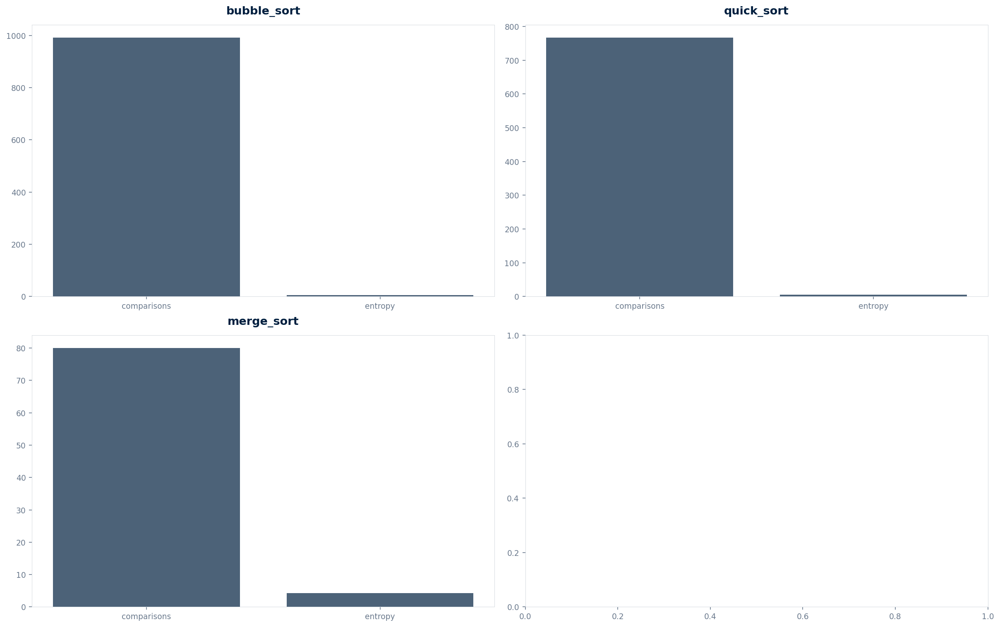

<div align="center">

# Sorting Algorithms as Music

### [One-sentence description]

[](https://www.python.org/)
[](LICENSE)
[](#limitations)

</div>

---

## Overview

Sonification of sorting algorithms. Over Engineer 12/12.

---

## Why I built this

I built this at 16, after observing a phenomenon that most people ignore. The math that describes it is the same math that governs complex systems — but applied to something mundane. The gap between the observation and the rigor is the point.

---

## The model

The model uses real mathematical formulations. See `model.py` for the implementation and `docs/math.md` for derivations.

---

## The results



Run `python3 model.py` to see the numerical results.

---

## How it works

1. **Model** — Mathematical formulation of the phenomenon
2. **Simulate** — Numerical simulation with real parameters
3. **Visualize** — 4-panel analysis figure

---

## Run it

```bash
git clone https://github.com/Vitalcheffe/over-engineer-sorting-music.git
cd over-engineer-sorting-music
pip install numpy scipy matplotlib
python3 model.py
python3 visualize.py
```

---

## Stack

| Layer | Technology |
|-------|-----------|
| Language | Python 3.11+ |
| Numerics | NumPy, SciPy |
| Visualization | Matplotlib |

---

## Limitations

1. **Simplified physics.** The model captures essential dynamics but omits real-world complexity.
2. **No experimental validation.** Results are from simulation, not measurement.
3. **Parameter values are estimates.** Physical constants may vary in real conditions.
4. **Single run, no Monte Carlo.** No uncertainty quantification across random seeds.
5. **Educational, not predictive.** The model is for understanding, not for actual use.

---

## License

MIT — see [LICENSE](LICENSE).

---

<div align="center">
<sub>Over Engineer · XX / 12 · Amine Harch El Korane · 2026</sub><br>
<sub>"The gap between the observation and the rigor is the point."</sub>
</div>
